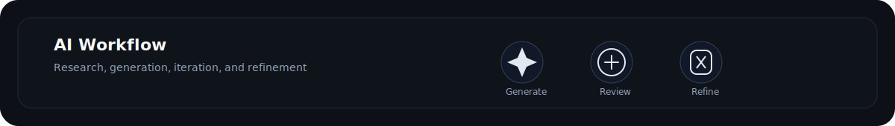

# Bright / Sunwin98

Developer focused on Minecraft Bedrock tooling, Node.js backend systems, web interfaces, and AI-assisted workflow design.

## Stack

## AI Workflow

## Focus

| Area | Details |
| --- | --- |
| Minecraft Bedrock | Addon builders, pack workflows, content tooling |
| Web Engineering | Node.js services, Vanilla JS UI, deployment automation |
| AI-assisted Work | Prompt design, code acceleration, structured iteration |

## Selected Work

### [Heaven Send Studio](https://github.com/Sunwin98/H-e-a-v-e-n-S-e-n-d)

Web platform for Minecraft Bedrock addon creation with skin conversion, pack merging, skill generation, and build automation.

**Core:** Node.js, Vanilla JS, Minecraft Bedrock, i18n, packaging pipeline

---

Built for a dark, minimal, engineering-first presentation.
